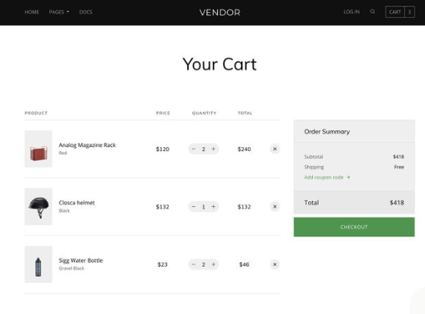

# 🛍️ ShopSmart – Full Stack E-Commerce Web Application

ShopSmart is a full-stack e-commerce web application built using **React**, **Node.js**, **Express**, and **MongoDB**.  
It provides a smooth online shopping experience with secure authentication, product browsing, cart management, and payment integration.

---

## 🚀 Features

- 🧑‍💻 **User Authentication** – Register and login using JWT tokens  
- 🛒 **Product Management** – Browse products by category or price range  
- ❤️ **Add to Cart / Wishlist** – Manage items before purchase  
- 💳 **Payment Gateway** – Secure online payments via Razorpay (demo/test mode)  
- 🔍 **Search & Filters** – Easily find products using smart filters  
- 🧾 **Order Management** – View past and current orders  
- 🖥️ **Admin Dashboard** – Add, edit, or delete products (for admin users)  
- 🌗 **Modern UI** – Fully responsive design using Tailwind CSS  

---

## 🧠 Tech Stack

| Layer | Technology |
|-------|-------------|
| Frontend | React.js, Tailwind CSS, Axios, React Router |
| Backend | Node.js, Express.js |
| Database | MongoDB (Mongoose) |
| Authentication | JWT (JSON Web Tokens), bcrypt |
| Payment | Razorpay API (Test Mode) |
| Hosting | Render / Vercel / MongoDB Atlas |

---

## 📸 Screenshots

| Home Page | Product Page | Cart Page |
|-----------|--------------|-----------|
|  |  |  |


---

## ⚙️ Installation & Setup

### 1️⃣ Clone the Repository
```bash
git clone https://github.com/<Akshaykumar1222>/ShopSmart.git
cd ShopSmart
2️⃣ Backend Setup
bash
Copy code
cd server
npm install
Create a .env file inside the server/ folder and add:

ini
Copy code
MONGO_URI=your_mongodb_connection_string
JWT_SECRET=your_secret_key
RAZORPAY_KEY_ID=your_key_id
RAZORPAY_KEY_SECRET=your_key_secret
PORT=5000
Run the backend server:

bash
Copy code
npm start
3️⃣ Frontend Setup
bash
Copy code
cd ../client
npm install
npm start
Your app will open at http://localhost:3000

🧩 Folder Structure
pgsql
Copy code
ShopSmart/
│
├── client/              # React frontend
│   ├── src/
│   │   ├── components/
│   │   ├── pages/
│   │   ├── context/
│   │   ├── App.js
│   │   └── index.js
│   └── package.json
│
├── server/              # Express backend
│   ├── models/
│   ├── routes/
│   ├── controllers/
│   ├── config/
│   ├── server.js
│   └── package.json
│
└── README.md
🧑‍💻 API Endpoints
Method	Endpoint	Description
POST	/api/auth/register	Register a new user
POST	/api/auth/login	Login user and get JWT token
GET	/api/products	Get all products
GET	/api/products/:id	Get single product details
POST	/api/cart	Add item to cart
DELETE	/api/cart/:id	Remove item from cart
POST	/api/order	Place an order
GET	/api/order/:userId	Get order history

🌍 Deployment
Frontend: Vercel / Netlify

Backend: Render / Railway

Database: MongoDB Atlas

Payment Gateway: Razorpay Test Mode

🤝 Contributing
Contributions are welcome!

Fork the repository

Create your feature branch

Commit your changes

Open a pull request

## ✨ Author

**Akshay Kumar**  
📧 [akshaykumarmajji@gmail.com.com](mailto:akshaykumarmajji@gmail.com)  
🌐 [GitHub Profile](https://github.com/Akshaykumar1222)
